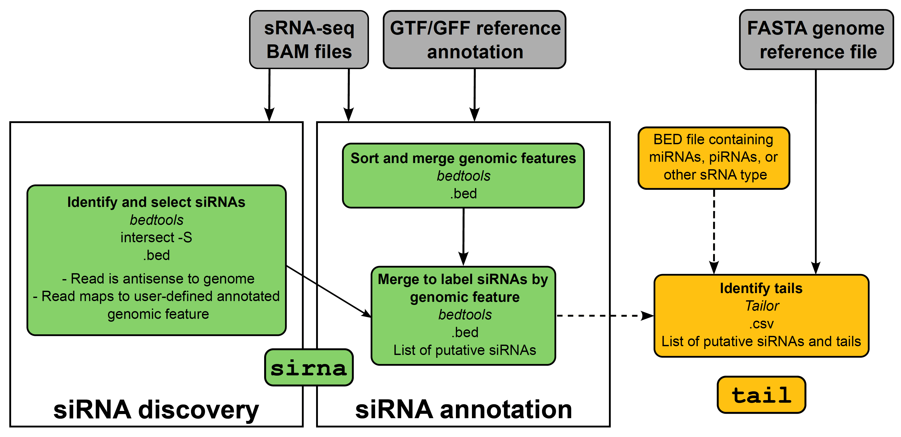

smalldisco
==========

<p float="left">
  <!--  -->
   
</p>


[](https://zenodo.org/badge/latestdoi/505596163)


smalldisco discovers putative siRNA regions in the genome and quantifies tails of small RNA reads.

Check out our preprint at https://www.biorxiv.org/content/10.1101/2022.07.15.500275v1 for details on how it works and examples of use cases.

## Installation

Installation steps:

1. Clone the smalldisco repository
2. Install Tailor
3. Create a conda environment for running smalldisco

First, clone this repository to your machine:

```console
$ git clone https://github.com/ianvcaldas/smalldisco.git
$ cd smalldisco
```

Smalldisco depends on the [Tailor](https://github.com/jhhung/Tailor) program for detecting read tails. By default, the Tailor repository is set up as a [submodule](https://git-scm.com/book/en/v2/Git-Tools-Submodules) of smalldisco. To initialize it, run this command from within the smalldisco folder:

```console
$ git submodule update --init
```

This will clone the Tailor repository as a folder. If you're running on Linux, you should be all set: an executable binary is available in `Tailor/bin/tailor_v1.1_linux_static`. If you're running on a different operating system, however, you will have to compile it from source yourself. See the Tailor documentation for instructions on how to do that.

To run smalldisco, you will need to install its software dependencies. They are listed in the file `environment.yaml`, which specifies a [conda](https://docs.conda.io/en/latest/) environment. We recommend using the  [mamba package mananger](https://mamba.readthedocs.io/) to install the environment instead of conda, as conda can sometimes fail when there are packages from conda-forge. To create a new conda environment called `smalldisco` using mamba, run:

```console
$ mamba env create -f environment.yaml
```

You can then activate the environment with `conda activate smalldisco`, run the program, and deactivate the environment with `conda deactivate` when you're done. You can also run a single command in the environment with `conda run -n smalldisco <command>`. Check the [conda documentation](https://docs.conda.io/projects/conda/en/latest/user-guide/tasks/manage-environments.html) for more information on conda environments.

If you prefer to avoid using conda or mamba, you can install the following dependencies through a method of your choice. The versions of each software used during smalldisco development are also indicated, and we recommend installing those versions for full reproducibility.

- Python v3.9, with packages Numpy v1.21.0, Pandas 1.2.5, and Click v8.1.3
- Snakemake v7.19.1
- Bedtools v2.29.2
- Samtools v1.11

## Usage

Use `python smalldisco.py --help` for main usage instructions. Smalldisco has two commands, `sirna` and `tail`, whose usage can be checked with `python smalldisco.py sirna --help` and `python smalldisco.py tail --help`, respectively.

Behind the scenes, smalldisco is actually implemented as a [Snakemake](https://snakemake.readthedocs.io/en/stable/) pipeline and `smalldisco.py` is just a wrapper script. The pipeline code and helper scripts are in the `workflow` folder, and the program will not work if `smalldisco.py` and `workflow` are not in the same directory.

Overall, to run both modes of smalldisco for a full siRNA identification and tailing analysis - `sirna` and `tail` - the user needs to provide their small RNA-seq alignment BAM files of interest, a GTF/GFF reference annotation file, and a FASTA genome reference file. Below, we outline the details of these modes.



### `sirna` mode

`sirna` identifies genomic regions to which user-provided reads map antisense. To this end, `sirna` requires:
* a GTF/GFF reference annotation file
  * Please be sure that your GTF/GFF file follows the standard tab-separated, nine-column format (https://useast.ensembl.org/info/website/upload/gff.html). 
* your small RNA-seq  alignment BAM files of interest in one folder
  * You can use any workflow or mapping program to create your sRNA-seq BAM files for analysis. However, be sure that your small RNA reads are trimmed of 3’ adapters (see the vignette in the "Example" section below).

The required and optional arguments can be viewed with `python smalldisco.py sirna --help`:

```
Usage: smalldisco.py sirna [OPTIONS] BAMFOLDER

  Find siRNA regions from antisense reads.

  This command generates putative siRNA regions based on .bam-formatted read
  alignment files in the folder BAMFOLDER.

Options:
  -o, --out PATH                  Name of output file in BED format.
                                  [default: sirna.bed]
  -a, --annotation PATH           Genome annotation file in either GTF or GFF
                                  format.
  -k, --annotation_kind [GTF|GFF]
                                  Format of genome annotation file.  [default:
                                  GTF]
  -f, --feature TEXT              Feature type in the annotation file assumed
                                  to contain siRNA regions.  [default: CDS]
  -r X                            Minimum amount of overlapping reads to
                                  create a putative siRNA region.  [default:
                                  10; x>=1]
  -s X                            Minimum size, in base pairs, of a putative
                                  siRNA.  [default: 10; x>=1]
  --help                          Show this message and exit.
  ```

The user must define the feature type (`-f`) from which they wish to map antisense reads to in their GTF/GFF file. For example, if one is interested in canonical siRNAs, the user could define their feature type as “CDS”. 

The main output file from this run will the BED formatted file `sirna.bed`, which will include all the identified siRNA across the samples within the BAM directory with the source gene name as a suffix and the number of reads that support that identification of that siRNA in the last column.

```
# COLS:chrom start end sirna_name score strand num_reads
NC_004354.4	124453	124632	sirna_Dmel_CG17636_01	.	-	812
NC_004354.4	124642	124719	sirna_Dmel_CG17636_02	.	-	117
NC_004354.4	124727	124801	sirna_Dmel_CG17636_03	.	-	55
NC_004354.4	124808	125330	sirna_Dmel_CG17636_04	.	-	954
NC_004354.4	125338	125383	sirna_Dmel_CG17636_05	.	-	17
NC_004354.4	125470	126040	sirna_Dmel_CG17636_06	.	-	496
NC_004354.4	126217	126281	sirna_Dmel_CG17636_07	.	-	37
NC_004354.4	126336	126406	sirna_Dmel_CG17636_08	.	-	14
NC_004354.4	749808	749840	sirna_Dmel_CG13362_01	.	-	15

```

### `tail` mode

`tail` uses Tailor to identify non-templated nucleotides (i.e., tails) on the 3’ end of small RNA reads. This mode requires: 
* a FASTA genome reference file
* your small RNA-seq alignment alignment BAM files of interest in one folder
* a list of small RNA regions in BED format
  * The user can use the output BED file of putative siRNAs from `sirna` or a predefined BED file of another small RNA type.
  * For users interested in non-siRNA small RNAs (such as miRNAs or piRNAs): one way to create a bed file for a specific small RNA type is to obtain a GTF/GFF file for only that small RNA type or to filter a genomic GTF/GFF file for your small RNA type of interest. Then, a tool such as `gtf2bed` or `gff2bed` (part of BEDOPs; https://bedops.readthedocs.io/en/latest/index.html) can be used to convert the GTF/GFF to a BED file.

NOTE: The chromosome annotation (II vs. chrII, for example) must match in the genome reference FASTA and small RNA regions BED files.

The required and optional arguments can be viewed with `python smalldisco.py tail --help`:

```
Usage: smalldisco.py tail [OPTIONS] BEDFILE BAMFOLDER

  Quantify tails of reads aligning to specified genome regions.

  This command quantifies tails from read alignments in .bam format found in
  BAMFOLDER. Only reads that overlap with certain genome regions, specified in
  .bed format in BEDFILE, are considered.

Options:
  -o, --out PATH                  Name of output file, in TSV (tab-separated
                                  values) format.  [default: tails.tsv]
  -g, --genome PATH               Reference genome in FASTA format.
  --tails-antisense / --tails-all
                                  Whether to quantify tails for antisense
                                  reads only or for all reads.  [default:
                                  tails-antisense]
  --tailor_command PATH           Path to Tailor binary executable.  [default:
                                  Tailor/bin/tailor_v1.1_linux_static]
  --tailor-min-prefix X           Minimum number of base pairs matching
                                  exactly in a read alignment before a tail
                                  can start. Equivalent to Tailor's '-l'
                                  command-line parameter.  [default: 18; x>=1]
  --help                          Show this message and exit.
```

The tailing result will be in the `tails.tsv` file, which will list the identified 3` tail and the number of reads for each siRNA that contain that tail modification. If there are multiple samples within the BAM directory, the sample names will be specified in the last column.

```
sirna_Dmel_CG10045_01	A	12	SRR23316511
sirna_Dmel_CG10045_01	AAA	1	SRR23316511
sirna_Dmel_CG10045_01	T	1	SRR23316511
sirna_Dmel_CG10045_03	A	1	SRR23316511
sirna_Dmel_CG10243_01	A	6	SRR23316511
sirna_Dmel_CG10245_01	A	3	SRR23316511
sirna_Dmel_CG10245_05	A	2	SRR23316511
sirna_Dmel_CG10245_05	G	2	SRR23316511
sirna_Dmel_CG10245_07	AA	1	SRR23316511
sirna_Dmel_CG10245_07	C	1	SRR23316511
sirna_Dmel_CG10245_07	T	2	SRR23316511
sirna_Dmel_CG10254_03	A	1	SRR23316511
sirna_Dmel_CG10254_04	C	1	SRR23316511
sirna_Dmel_CG10279_01	A	1	SRR23316511
sirna_Dmel_CG10375_01	A	4	SRR23316511

```

### Tailor integration

When running the `tail` command, we assume by default that the path to the Tailor executable is `Tailor/bin/tailor_v1.1_linux_static`. This will work if you are on Linux, are in the smalldisco repository, (e.g. `cd smalldisco`), and the Tailor submodule has been initialized as described in the installation section. If you are running smalldisco from a different folder, or have a custom Tailor installation, you must specify a path to a valid Tailor executable, for instance:

```console
$ python smalldisco.py tail --tailor_command /usr/local/bin/tailor
```

## Example

The [vignette](https://github.com/ianvcaldas/smalldisco/wiki/Smalldisco-vignette) showcases the use of smalldisco in an example real-life dataset.
