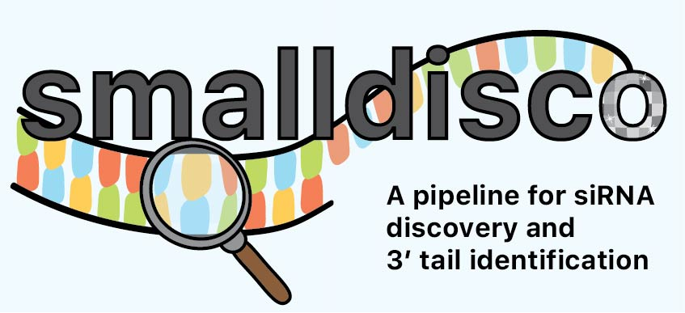

smalldisco
==========




smalldisco discovers putative siRNA regions in the genome and quantifies tails of small RNA reads.

Check out our preprint at https://www.biorxiv.org/content/10.1101/2022.07.15.500275v1 for details on how it works and examples of use cases.

### Installation

Installation steps:

1. Clone the smalldisco repository
2. Install Tailor
3. Create a conda environment for running smalldisco

First, clone this repository to your machine:

```console
$ git clone https://github.com/ianvcaldas/smalldisco.git
$ cd smalldisco
```

Smalldisco depends on the [Tailor](https://github.com/jhhung/Tailor) program for detecting read tails. By default, the Tailor repository is set up as a [submodule](https://git-scm.com/book/en/v2/Git-Tools-Submodules) of smalldisco. To initialize it, run this command from within the smalldisco folder:

```console
$ git submodule update --init
```

This will clone the Tailor repository as a folder. If you're running on Linux, you should be all set: an executable binary is available in `Tailor/bin/tailor_v1.1_linux_static`. If you're running on a different operating system, however, you will have to compile it from source yourself. See the Tailor documentation for instructions on how to do that.

To run smalldisco, you will need to install its software dependencies. They are listed in the file `environment.yaml`, which specifies a [conda](https://docs.conda.io/en/latest/) environment. We recommend using the  [mamba package mananger](https://mamba.readthedocs.io/) to install the environment instead of conda, as conda can sometimes fail when there are packages from conda-forge. To create a new conda environment called `smalldisco` using mamba, run:

```console
$ mamba env create -f environment.yaml
```

You can then activate the environment with `conda activate smalldisco`, run the program, and deactivate the environment with `conda deactivate` when you're done. You can also run a single command in the environment with `conda run -n smalldisco <command>`. Check the [conda documentation](https://docs.conda.io/projects/conda/en/latest/user-guide/tasks/manage-environments.html) for more information on conda environments.

### Usage

Use `python smalldisco.py --help` for main usage instructions. Smalldisco has two commands, `sirna` and `tail`, whose usage can be checked with `python smalldisco.py sirna --help` and `python smalldisco.py tail --help`, respectively.

Behind the scenes, smalldisco is actually implemented as a [Snakemake](https://snakemake.readthedocs.io/en/stable/) pipeline and `smalldisco.py` is just a wrapper script. The pipeline code and helper scripts are in the `workflow` folder, and the program will not work if `smalldisco.py` and `workflow` are not in the same directory.

#### Tailor integration

When running the `tail` command, we assume by default that the path to the Tailor executable is `Tailor/bin/tailor_v1.1_linux_static`. This will work if you are on Linux, are in the smalldisco repository, (e.g. `cd smalldisco`), and the Tailor submodule has been initialized as described in the installation section. If you are running smalldisco from a different folder, or have a custom Tailor installation, you must specify a path to a valid Tailor executable, for instance:

```console
$ python smalldisco.py tail --tailor_command /usr/local/bin/tailor
```

### Example

This repository comes with example data in the `example` folder. To test that smalldisco is installed correctly, you can run a toy analysis with:

```console
$ bash example-run.sh
```
This should create two outputs: `example/sirna.bed` with locations of putative siRNA regions and `example/tails.tsv` with quantified read tails.
